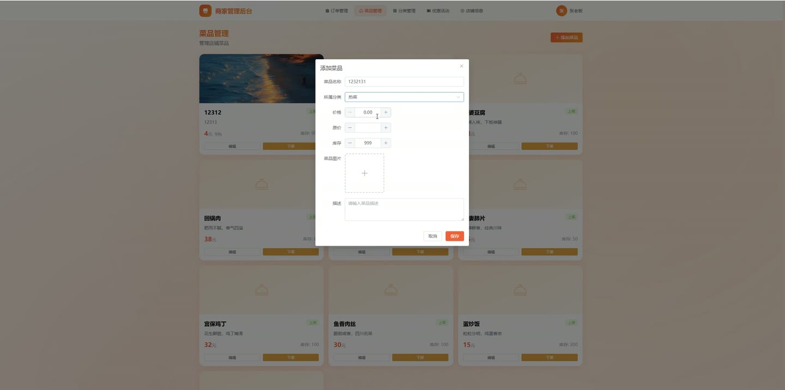
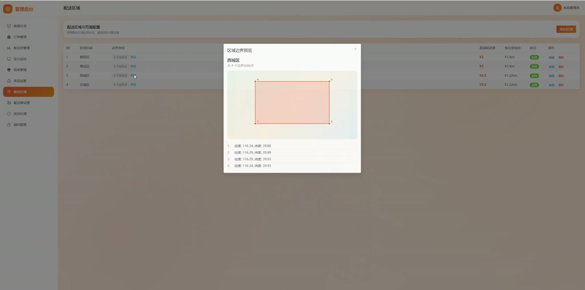
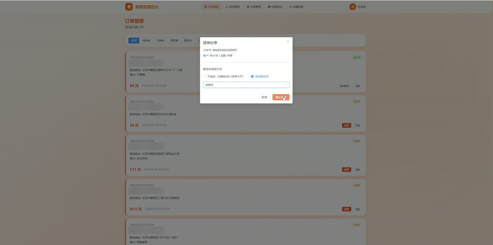
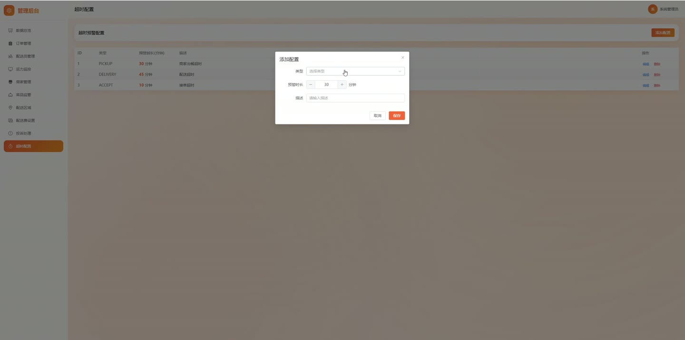
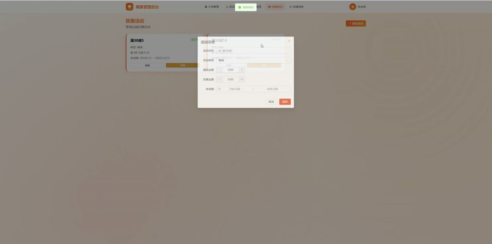
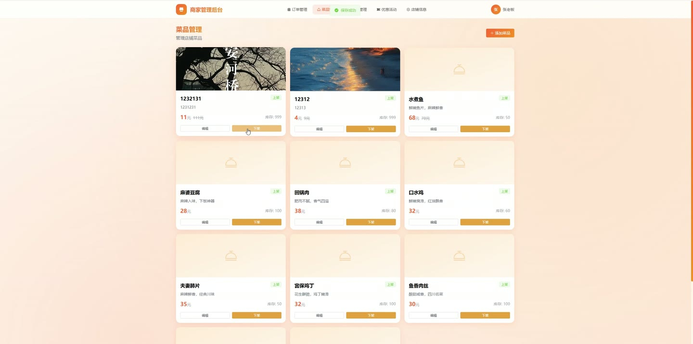

# (附文档)Springboot3+Vue3+MySQL 外卖配送系统

**技术栈**：Springboot3、Vue3、MySQL

### 系统简介

本系统是一套基于 Spring Boot 3 + Vue 3 前后端分离的外卖配送管理平台，支持管理员、商家、配送员三种角色协同工作。系统提供订单全流程管理（接单、备餐、取餐、配送、完成）、商家店铺与菜品管理、配送员抢单与收入统计、配送区域与计费规则配置、投诉与异常处理等功能，适用于中小型外卖平台的日常运营管理。
 
### 核心功能
 
### 管理员端

 
- 查看系统总览仪表盘，实时统计在线配送员、配送中人数、离线人数及总人数 
- 查看所有订单列表，支持按订单状态、订单编号筛选与分页查询 
- 查看所有商家列表，支持按店铺名称关键词搜索、按状态筛选，可启用/停用店铺 
- 查看所有配送员列表，支持按工作状态筛选，可查看详情并编辑配送员信息 
- 查看所有菜品列表，支持按店铺、分类、状态、关键词筛选，可上下架菜品或修改库存 
- 管理配送区域（DeliveryRegion）：新增、编辑、删除区域，设置区域名称、边界坐标、基础配送费、每公里附加费 
- 管理配送费规则（DeliveryFeeRule）：为每个区域配置不同时段的基础配送费，支持按距离区间分段计费 
- 处理投诉工单（Complaint）：查看投诉列表（按状态筛选），查看投诉详情，填写处理结果并标记为已处理 
- 处理订单异常（OrderException）：查看异常列表（按状态筛选），查看异常详情，填写处理结果并标记为已处理 
- 管理超时配置（TimeoutConfig）：新增、编辑、删除超时规则，设置超时类型、阈值分钟数及描述 
- 管理用户（SysUser）：查看用户列表（按角色/关键词筛选），新增用户（支持创建配送员并自动生成 RiderInfo），编辑用户信息，启用/禁用用户 
- 审核待审核的配送员（pending-riders）和商家（pending-merchants）注册申请，通过或拒绝审核 
- 手动为订单指派配送员（assignRider），或强制指派（forceAssignRider） 
- 查看配送运力概览（RiderCapacity），统计在线、配送中、离线人数
 
### 商家端

 
- 查看本店订单列表，支持按订单状态筛选，查看订单详情（含订单项） 
- 接单（acceptOrder）：将订单状态从未接单更新为已接单 
- 备餐完成（prepareComplete）：将订单状态从已接单更新为已备餐完成，等待配送员取餐 
- 管理菜品分类（DishCategory）：为店铺新增、编辑、删除菜品分类，支持排序 
- 管理菜品（Dish）：为店铺新增菜品（设置名称、图片、价格、原价、描述、库存、所属分类），编辑菜品信息，上下架菜品，修改库存数量 
- 管理促销活动（Promotion）：为店铺新增促销（设置名称、类型（满减/折扣）、满减门槛、折扣金额/折扣率、活动起止时间），编辑促销，启用/停用促销 
- 查看和编辑店铺信息（MerchantShop）：修改店铺名称、Logo、Banner、描述、地址、电话、营业时间 
- 查看本店月度销量和评分
 
### 配送员端

 
- 查看可抢订单列表（pageAvailable）：显示所有待配送的订单，支持分页 
- 抢单（grabOrder）：从可抢订单列表中选择订单并抢单，成功后订单绑定当前配送员 
- 查看我的配送订单列表（pageByRider），支持按订单状态筛选 
- 取餐操作（pickupOrder）：输入取餐码验证后，将订单状态更新为配送中 
- 配送完成（deliveryComplete）：将订单状态更新为已完成 
- 查看个人收入记录（IncomeRecord）：分页查看每笔收入明细（金额、类型、描述、时间） 
- 查看收入统计（IncomeStatistics）：统计总收入、本月收入、今日收入等汇总数据 
- 查看个人配送统计（OrderStatistics）：获取总订单数、完成订单数、配送里程等统计 
- 切换工作状态（updateWorkStatus）：在线/离线/配送中状态切换 
- 提交订单异常（OrderException）：对配送中的订单提交异常报告（类型、描述、图片） 
- 提交转单请求（TransferRequest）：将已接订单转给其他配送员，填写转单原因 
- 查看待处理的转单请求列表，可接受或拒绝转单
 
### 技术栈

  后端框架 Spring Boot 3.x   ORM MyBatis-Plus 3.x   权限认证 JWT（手动校验 Token）   前端框架 Vue 3（Composition API + script setup）   状态管理 Pinia   路由 Vue Router 4（Hash 模式）   UI 组件库 Element Plus   构建工具 Vite   数据库 MySQL 8.x   文件上传 本地文件存储 + MultipartFile 
 
### 交付内容

 
- 后端完整源码 
- 前端完整源码 
- 数据库初始化脚本 
- 万字文档

## 界面展示

---

## 获取完整源码 + 万字文档

本仓库为项目介绍页。**完整前后端源码、数据库初始化脚本、万字项目文档**，请加微信 `kangkangcode`，或访问 [codekk.top](http://codekk.top) 获取。

可作课程设计 / 毕业设计参考，支持远程部署调试。